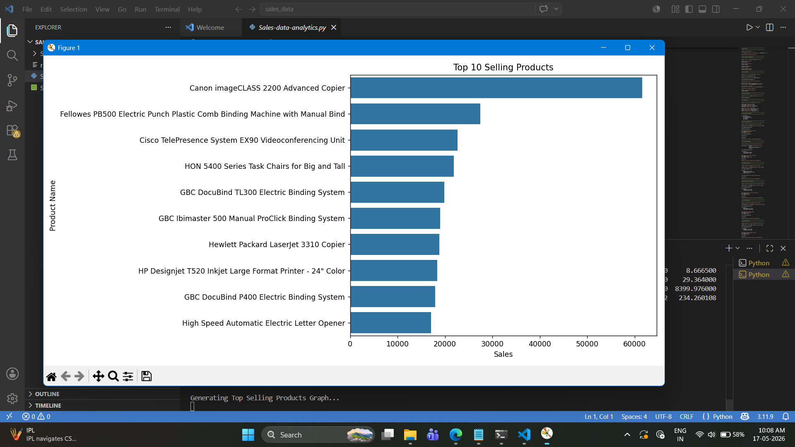
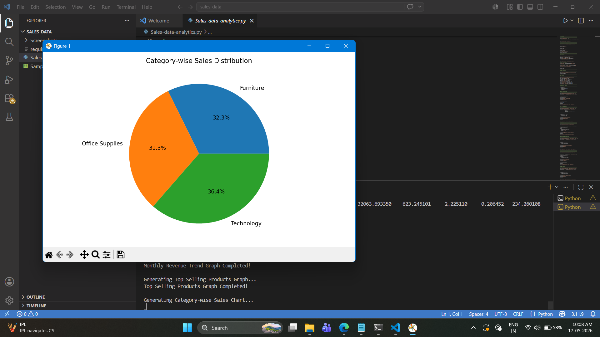
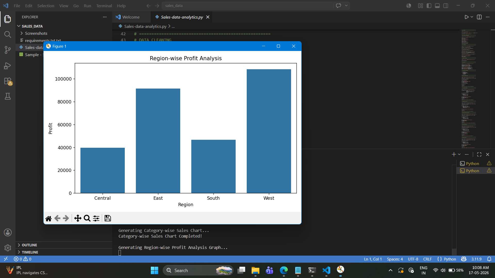
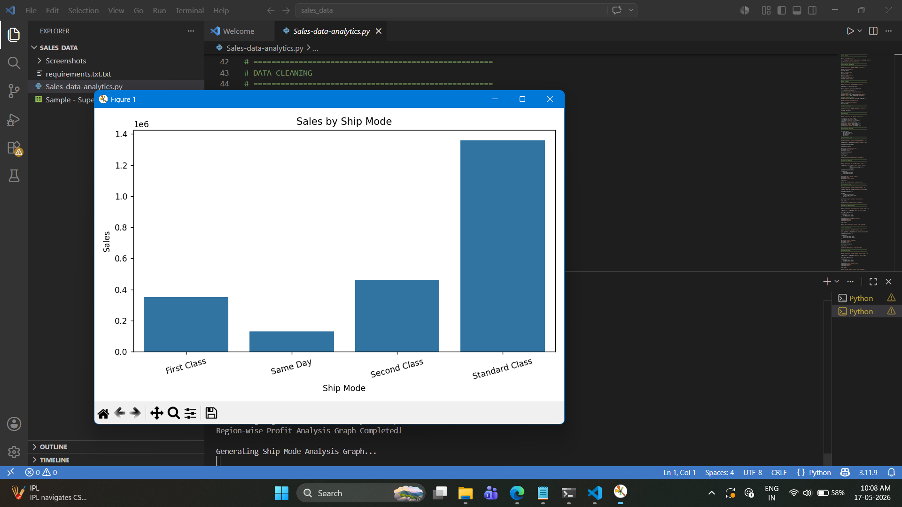
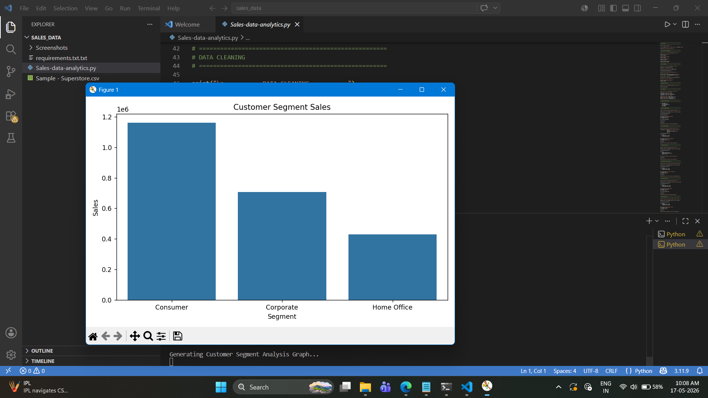
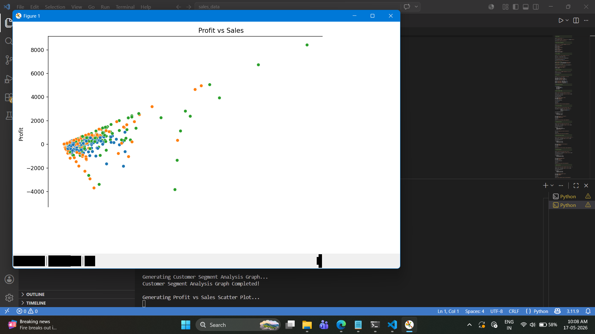
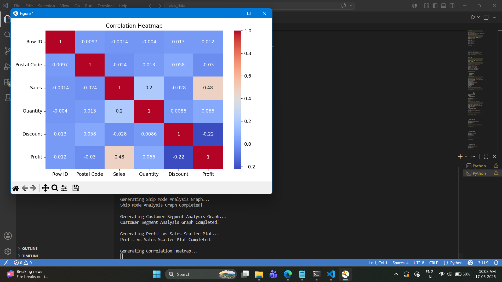

# 📊 Sales Data Analysis

## 📌 Project Overview
This project focuses on analyzing Superstore sales data to identify revenue trends, profit insights, customer behavior, and overall business performance using Python and data visualization techniques.

The analysis helps in understanding:
- Monthly revenue growth
- Top-performing products
- Profit distribution
- Customer segments
- Regional business performance

---

# 🎯 Objective

The main objectives of this project are:

✔ Analyze sales and profit trends  
✔ Identify top-selling products  
✔ Perform KPI analysis  
✔ Generate business insights using visualization  
✔ Understand customer and regional performance  

---

# 🛠 Technologies Used

- Python
- Pandas
- NumPy
- Matplotlib
- Seaborn

---

# 📂 Dataset

Dataset Used:
Superstore Sales Dataset from Kaggle

Dataset File:
`Sample - Superstore.csv`

---

# 📊 Features Implemented

✔ Data Cleaning  
✔ Duplicate Removal  
✔ KPI Analysis  
✔ Revenue Trend Analysis  
✔ Profit Analysis  
✔ Customer Segment Analysis  
✔ Region-wise Analysis  
✔ Correlation Heatmap  
✔ Data Visualization  

---

# 📈 Key Insights

- Technology category contributes high sales.
- Certain regions generate higher profits than others.
- Monthly revenue shows seasonal growth trends.
- Higher sales do not always indicate higher profit.
- Customer segments contribute differently to overall revenue.

---

# 📷 Project Screenshots

### Monthly Revenue Trend


### Top Selling Products


### Category-wise Sales


### Region-wise Profit Analysis


### Ship Mode Analysis


### Customer Segment Analysis


### Correlation Heatmap


---

# 🚀 How to Run the Project

## Step 1: Install Required Libraries

```bash
pip install -r requirements.txt
```

## Step 2: Run the Python File

```bash
python sales_analysis.py
```

---

# 📁 Project Structure

```text
sales_data/
│
├── README.md
├── requirements.txt
├── sales_analysis.py
├── Sample - Superstore.csv
│
└── Screenshots/
    ├── Figure1.png
    ├── Figure2.png
    ├── Figure3.png
    ├── Figure4.png
    ├── Figure5.png
    ├── Figure6.png
    └── Figure7.png
```

---

# 👩‍💻 Author

**Nireeksha P**

Computer Science Engineering Student  
Data Science & Machine Learning Enthusiast

---

# ✅ Project Status

✔ Completed Successfully
